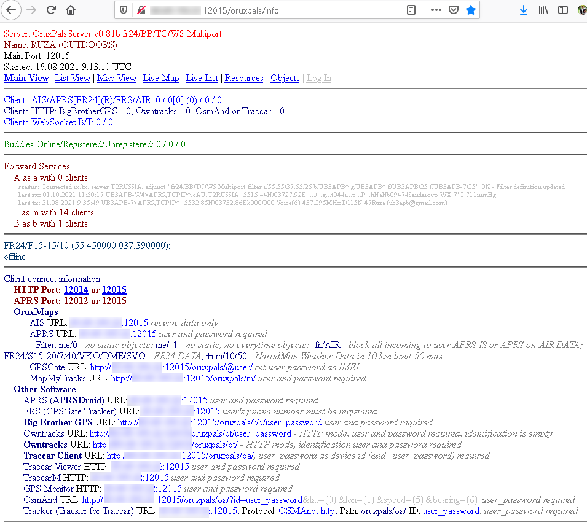
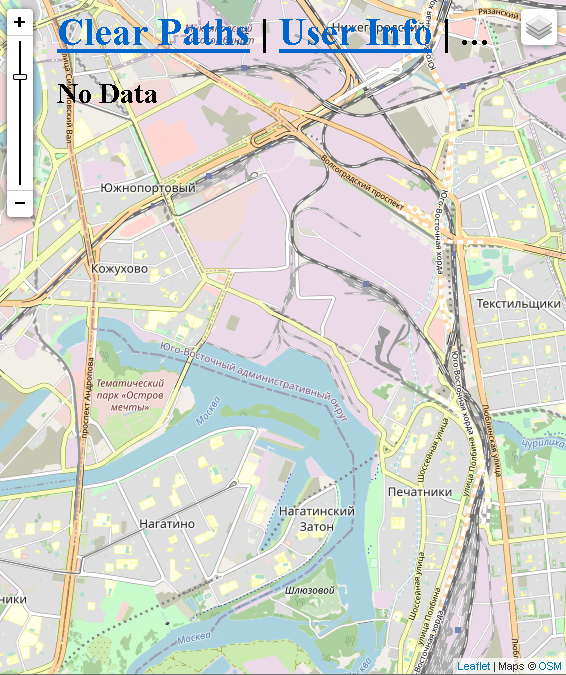
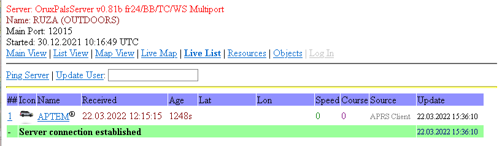
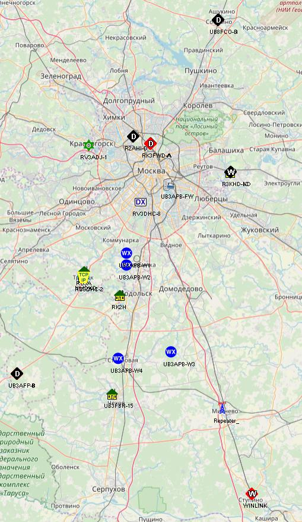
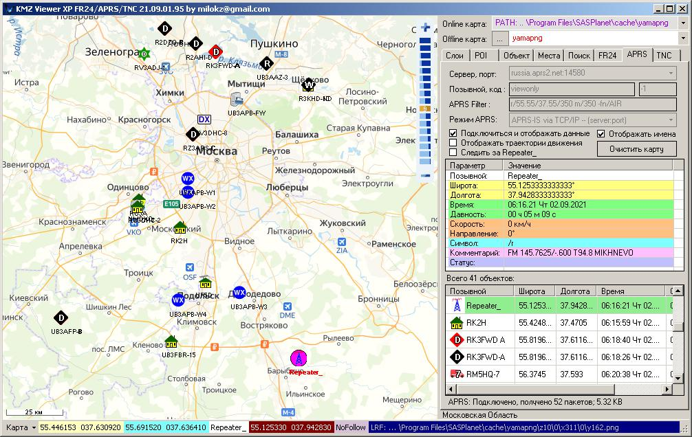
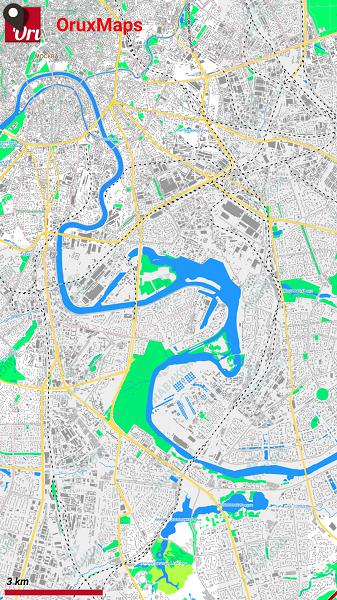

# Orux Pals Server

Short about:
This is the OruxPalsServer (APRS Server) specially written for OruxMaps Android Application 
(6.5.5+ for AIS and 7.0.0rc9+ for APRS) and APRS. The server can receive position from
OruxMaps application by GPSGate (HTTP GET) protocol, MapMyTracks protocol or
APRS protocol. Server stores received positions and send it to all clients connected 
by AIS or APRS. So you can watch on the map (alse with any browser) user position in real time as vessels 
(by AIS) or as aprs icons (by APRS) with names.

To connect and send position to the server client must have unical name and password, 
which can be generated by server administrator.

Real time tracking:
Users can upload their positions to the server by GPSGate (HTTP GET & TCP FRS),
MapMyTracks or APRS protocols, and their position will immediately broadcast to all 
connected AIS or APRS clients.
APRS clients can specify filters to pass or block incoming users positions from server. 
So if you have some groups of users that should not receive positions from another 
group, you can use it. 

Most-used static objects (Everytime Objects):
Server can send to each APRS user global objects (to each user) from XML file.

Route mode (Static Objects):
Server can send nearest (in km range) static objects to each APRS client 
(client need to upload position by APRS). Static objects could be loaded from XML, 
KML or selected from SQLite. 

Server also can filter sending data to each client with specified user filters:
- range filter for static objects (me/10/50);
- name filters to pass or block incoming positions from users or static objects 
  (+sw/ +ew/ +fn/ -sw/ -ew/ -fn/).
  
On-Air function:
You can connect to OruxPalsServer with specially written OruxPalsAir client 
to receive AFSK 1200 AX.25 packets from Air and send them through your 
SoundCard Direct Input/Output. So OruxPalsServer can receive/send AFSK
packets. But:
- server will send packets to Air (OruxPalsAir client) directly received from
APRS clients only; no from Global APRS, MapMyTracks, GPSGate or FRS. So
if you connected to server with OruxMaps only APRS packets will be
translated to Air;
- if aprs2global==yes all packets received from Air (OruxPalsAir client) will be
directly forwarded to global APRS;
- there is no callsign/user replaces for incoming packets from air. So if callsign
specified in <u><service names="A" id="..."/></u> in system user name will be
as in air packet callsign, not <u name="..."/>!

     
     
     
     

